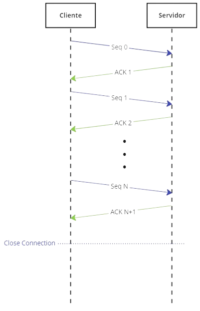
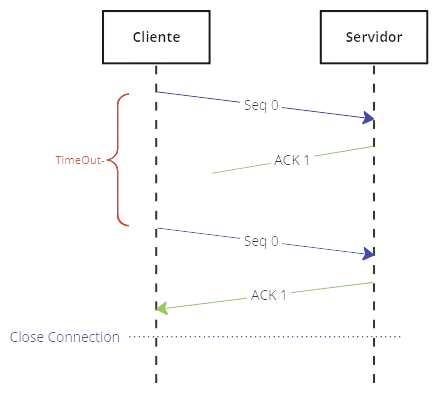
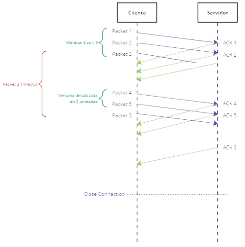
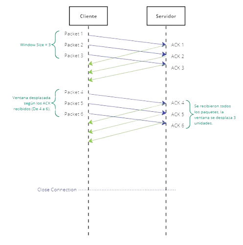
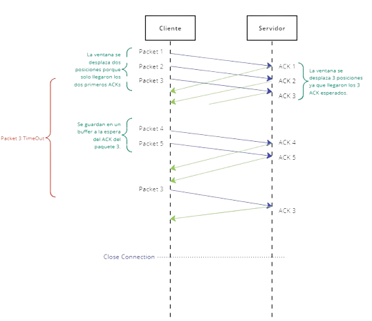
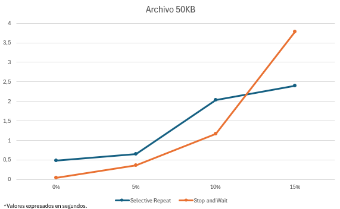
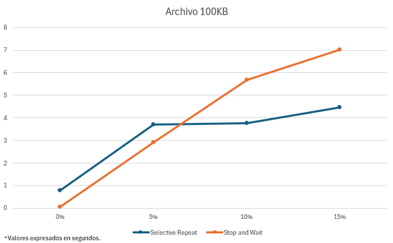
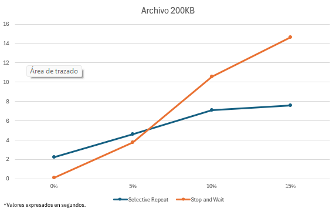

# Introducción

Este trabajo práctico tiene como objetivo crear una aplicación de red para transferir archivos entre cliente y servidor. Se implementarán dos operaciones fundamentales: 
- UPLOAD (enviar archivos del cliente al servidor)
- DOWNLOAD (descargar archivos del servidor al cliente).

 Se tendrán en cuenta los protocolos TCP y UDP para la comunicación. 
 
 TCP ofrece un servicio confiable orientado a la conexión, mientras que UDP es sin conexión y menos confiable. Se implementarán versiones de UDP con protocolo Stop & Wait y Selective Repeat con el objetivo de lograr una transferencia confiable al utilizar el protocolo.

# Hipótesis y suposiciones realizadas

- No tendremos paquetes corruptos, UDP lo valida previamente.
- El archivo a descargar siempre se encuentra presente en el servidor.
- Si un archivo a subir ya se encuentra en el servidor, se reemplaza su contenido.
- El tamaño maximo de mensaje sera de 1GB.

---

# Implementación

### Cliente

La funcionalidad del cliente se divide en dos aplicaciones de línea de comandos: **upload** y **download**.

###### Upload:

El comando `upload` envía un archivo al servidor para ser guardado con el nombre asignado.

`python3 upload.py [-h] [-v | -q] [-H ADDR] [-p PORT] [-s FILEPATH] [-n FILENAME] [-sw | -sr]`

Donde cada flag indica:

- `-h, --help`: Imprime el mensaje de "help"
- `-v, --verbose`: Incrementa en uno la verbosidad en cuanto al sistema de logueo del servidor.
- `-q, --quiet`: Decrementa en uno la verbosidad en cuanto al sistema de logueo.
- `-H, --host`: Indica la dirección IP del servicio.
- `p, --port`: Indica el puerto.
- `-s, --src`: Indica el path del archivo a subir.
- `-n, --name`: Nombre del archivo a subir.
- `-sw`: Ejecuta el comando con el comportamiento de Stop and Wait.
- `-sr`: Ejecuta el comando con el comportamiento de Selective Repeat.

En la implementación, esta operación sigue los siguientes pasos:

- Primero, se establece una conexión utilizando un Socket en el host y el puerto proporcionado como parámetro. Luego, se envía una estructura de Metadata al servidor, especificando el nombre que va tener el archivo en el servidor, y si el upload se va a hacer con el protocolo de Selective Repeat o con Stop and Wait.
- Una vez que se ha enviado la Metadata, comienza la transferencia real del archivo. Para garantizar una transferencia eficiente, el archivo se divide en segmentos más pequeños, cada uno con un tamaño máximo definido (en nuestro caso es de 512 Bytes). Estos segmentos se envían uno por uno al servidor hasta que se haya enviado todo el archivo. Es importante destacar que si el tamaño del archivo no es un múltiplo exacto del tamaño máximo del mensaje, el último segmento puede ser más pequeño.
- Una vez que se ha enviado todo el archivo, se espera una respuesta del servidor para confirmar si la transferencia se realizó correctamente. Esta respuesta puede contener información sobre si el archivo se recibió correctamente o si hubo algún problema durante la transferencia, ayudandonos a garantizar la entrega.

###### Download:

El comando `download` descarga un archivo especificado desde el servidor.

`python3 download.py [-h] [-v | -q] [-H ADDR] [-p PORT] [-d FILEPATH] [-n FILENAME] [-sw | -sr] `

Donde todos los flags indican lo mismo que con el comando anterior, con la diferencia de `-d, --dst` que indica el path de destino del archivo a descargar. Además con el flag `-n` indicamos cual es el nombre del archivo a descargar del servidor.

En nuestra implementación, sin importar el protocolo, esta operación sigue los siguientes pasos:

Al igual que `upload`, para comenzar la transferencia de archivos, primero necesitamos establecer un socket utilizando el protocolo adecuado. Luego, el cliente enviará la estructura Metadata al servidor. Una vez que el servidor recibe la Metadata, puede determinar el tamaño del archivo que se va a transferir el cual es enviado de vuelta al cliente para que este último conozca cuántos bytes esperar durante la descarga.

Esta información permite al cliente prepararse para recibir la descarga completa del archivo, asegurándose de manejar correctamente cada segmento para reconstruir el archivo original en su sistema local. Una vez que se ha completado la descarga de todos los segmentos, el cliente confirma la integridad de la transferencia.

### Servidor

El servidor debe estar preparado para recibir un mensaje que indica que comienza una nueva conexión, es decir que tiene que estar ejecutándose como proceso antes de que el cliente trate de iniciar el contacto. Es por eso, que el primer comando a ejecutar es el `start-server`.

`start-server.py [-h] [-v | -q] [-H ADDR] [-p PORT] [-s DIRPATH]`

Donde los flags indican:

- `-h/--help`: Imprime el mensaje de "help"
- `-v/--verbose`: Incrementa en uno la verbosidad en cuanto al sistema de logueo del servidor
- `-q/--quiet`: Decrementa en uno la verbosidad en cuanto al sistema de logueo.
- `-H/--host`: Indica la dirección IP del servicio
- `-p/--port`: Indica el puerto
- `-s/--storage`: El path en el que se almacenan los archivos.

El servidor va a proveer el servicio de subida y bajada de archivos. 

Para ello seguirá los siguientes pasos:

Cuando el servidor recibe el comando "start-server", crea un nuevo servidor y comienza a escuchar en el puerto especificado para nuevas conexiones entrantes. Una vez que el servidor está creado y escuchando, permanece a la espera de una conexion.
Cuando se establece una nueva conexión, el servidor acepta la conexión y crea un nuevo hilo para manejarla. Esto permite al servidor seguir esperando nuevas conexiones mientras maneja la conexión actual en un hilo separado. Este enfoque de subprocesos múltiples asegura que el servidor pueda manejar múltiples conexiones simultáneamente.
Una vez que se ha establecido la conexión y se ha creado un nuevo hilo para manejarla, el servidor espera recibir la Metadata correspondiente a la operación de "UPLOAD" o "DOWNLOAD".

Para **UPLOAD**, hay que encargarse de recibir un archivo:

- Recibirá el archivo de a segmentos de tamaño `MAX_MESSAGE_SIZE = 1024`, por lo tanto, teniendo en cuenta que ya conoce su tamaño, va a iterar hasta saber que consiguió el archivo completo. Una vez que finalizó, se encarga de mandar un mensaje al cliente de que finalizó correctamente el comando.

Para **DOWNLOAD**, hay que encargarse de envíar un archivo:

- Una vez que el servidor ubica el archivo solicitado, le envía al cliente el tamaño del archivo. Luego, le envía el archivo al cliente de a segmentos de a `MAX_MESSAGE_SIZE = 1024`. Y al finalizar, espera que el cliente le mande un mensaje indicando que recibió el archivo correctamente.

### Handshake

A continuación detallaremos el funcionamiento del handshake para cada uno de los protocolos

###### Stop and Wait

1. **Envío del ACK (Acknowledgement) por el Cliente:**

   - En el método `receive(self, is_server)`, el cliente (o el servidor si `is_server` es `True`) envía un mensaje de tipo ACK (`ACK_TYPE`) al otro extremo del canal de comunicación, indicando que está listo para recibir datos.
   - Este mensaje incluye el número de secuencia actual (`self.seq_num`) para la sincronización.
2. **Transferencia de Datos:**

   - Después de enviar el ACK, el cliente (o el servidor) espera recibir datos del otro extremo.
   - El cliente espera recibir un paquete de datos del servidor en el método `receive`. Si se recibe un paquete dentro del tiempo de espera (`TIMEOUT`), se envía un ACK de confirmación de recepción.
    - El servidor, por otro lado, espera recibir un ACK del cliente en el método `send`. Si se recibe un ACK válido, se procede a enviar el siguiente paquete de datos. Si no, se continúa retransmitiendo el paquete hasta que se reciba el ACK o se alcance el número máximo de intentos (`MAX_TRIES`).
3. **Acknowledgement de finalización de transferencia:**

    - El cliente y el servidor continúan este intercambio de datos y ACK hasta que se completa la transferencia del archivo o hasta que ocurra un error.

    

Si hay pérdida de paquetes durante la transferencia de datos, el protocolo Stop-and-Wait manejaría esta situación de la siguiente manera:

1. **Pérdida de ACK (Acknowledgement):**

    - Si el cliente envía un paquete de datos al servidor o al cliente y no recibe un ACK de confirmación dentro del tiempo de espera especificado (`TIMEOUT`), asume que el paquete se perdió en el camino y retransmite el mismo paquete.
    - El cliente continuará retransmitiendo el paquete hasta que reciba un ACK válido o alcance el número máximo de intentos (`MAX_TRIES`).

2. **Manejo de Retransmisiones:**

    - Tanto el cliente como el servidor mantendrán un contador de intentos (`self.tries`) para rastrear el número de retransmisiones de paquetes.
    - Si el número de intentos alcanza el límite máximo (`MAX_TRIES`), se considera que ha ocurrido un error en la comunicación y se finaliza la transferencia con un mensaje de error.

Este protocolo maneja la pérdida de paquetes mediante la retransmisión de paquetes perdidos y el seguimiento de intentos para evitar la congestión de la red. Esto asegura que la transferencia de datos sea confiable incluso en entornos donde pueda haber pérdida de paquetes.




* **~~ESCRIBIR PARTE DE PÉRDIDA DE PAQUETE~~ **



###### Selective Repeat

1. **Envío del ACK (Acknowledgement) por el Cliente:**

    - Cuando el cliente recibe un paquete de datos, procesa y responde al servidor, confirmando la recepción exitosa. Esto se realiza en el método `process_data`.
    - Cuando el cliente recibe un paquete de datos, si es el esperado (es decir, su número de secuencia coincide con el esperado), el cliente envía un ACK al servidor indicando el número de secuencia del último paquete recibido correctamente. Esto se hace en el método `process_data` y en la sección donde se comprueba si `is_server` es `False`.
    - Si el cliente recibe un paquete fuera de secuencia, lo almacena en una lista de pendientes (`pendings`) y no envía un ACK hasta que se reciba el paquete esperado. Esto también se maneja en `process_data`.
    
2. Transferencia de Datos:
    - La transferencia de datos se realiza en el método `send` del cliente.
    - Se envían paquetes de datos al servidor en un bucle `for` que lee datos del archivo y los envía en paquetes.
    - Los paquetes se envían con un número de secuencia único y se almacenan en una lista de pendientes para su seguimiento.
    - Se usa una ventana deslizante para controlar cuántos paquetes pueden ser enviados antes de recibir un ACK. Esto se implementa con la variable `WINDOW_SIZE`.

3. Acknowledgement de finalización de transferencia:
    - Cuando el servidor recibe el último paquete de datos y lo procesa, envía un ACK de finalización al cliente para indicar que la transferencia ha sido completada. Esto se hace en el método `send` del servidor cuando se envía el último paquete.

4. Pérdida de ACK (Acknowledgement):
    - Si el cliente no recibe un ACK del servidor dentro de un tiempo determinado, se considera que el ACK se ha perdido y el cliente reenvía el último paquete de datos enviado. Esto se implementa en el método `recv_acks`.

5. Manejo de Retransmisiones:
    - Si el cliente no recibe un ACK del servidor dentro de un tiempo determinado, reenvía el último paquete de datos enviado.
    - Si el servidor no recibe un paquete de datos dentro de un tiempo determinado, reenvía un ACK negativo (NACK) para solicitar la retransmisión de ese paquete.
    - La retransmisión selectiva se realiza en base a los ACK y NACK recibidos, reenviando solo los paquetes que no fueron confirmados correctamente.
    - El manejo de retransmisiones también se realiza en el método `recv_acks` y en el método `check_timeouts`.



* **~~ESCRIBIR PARTE DE PÉRDIDA DE ACK~~**



* **~~ESCRIBIR PARTE DE PÉRDIDA DE PAQUETE~~**


### Cierre de conexión

    ~~En esta sección se explicará que se implementará para finalizar la conexión, NO con un Ctrl + C.~~

---

# Pruebas

## Mininet

Para este trabajo utilizamos una topología de 1 switch y 3 host, donde 1 de ellos actúa como servidor y cada host está linkeado con el switch.

1. Tener instalado mininet. [ver](https://mininet.org/download/)

2. Ejecutar el siguiente comando para establecer la topología anteriomente mencionada:

```
sudo mn --topo linear,1,4
```

3. Establecemos la pérdida de paquetes en todos los host. En este caso h1, h2 y h3:

- Si se quiere establecer pérdida de paquete en el switch:

```
s1 tc qdisc add dev s1-eth1 root netem loss 10%
```

- Si se quiere establecer pérdida de paquete en el host:

```
h1s1 tc qdisc add dev h1s1-eth0 root netem loss 10%
```

**Nota**: análogamente ejecutamos el comando para eth2 y eth3.

4. abrimos las terminales para c/u de los host, incluyendo el servidor:

```
xterm h1
```
**Nota**: análogamente abrimos terminales para h2 y h3.

5. Levantamos el servidor y probamos los comandos upload u download.

## Para correr server y cliente:

1. Ejecucion server:
```
python3 start-server.py -H 10.0.0.1 -p 12000 -s ./ -v
```

2. Ejecución cliente upload: 
```
python3 upload.py -H 10.0.0.1 -p 12000 -s archivo1mb.bin -n archivo1mbUP.bin -sw -v

```

3. Ejecución cliente download:
```
python3 download.py -H 10.0.0.1 -p 12000 -s archivo1mbDown.bin -n archivo1mb.bin -sw -v
```

4. Chequeo entre archivos: 
```
md5sum lib/server/files/archivo1mb.bin lib/client/files/archivo1mbDown.bin
```


## Wireshark

Para constatar que los mensajes de nuestro protocolo son como exactamente se describen en este informe, se pueden capturar paquetes con Wireshark, por lo que creamos un plugin que parsea los bytes de los mensajes de la capa de aplicación a los campos de nuestro protocolo (dissector.lua). 

Para probarlo debemos seguir los sigueintes pasos:

1. Instalar la versión del lenguaje [lua](https://www.lua.org/download.html) que sea compatible con tu versión de wireshark. [ver](https://www.wireshark.org/docs/wsdg_html_chunked/wsluarm.html)


2. Ubicarse en el directorio donde está ubicado el <dissector>.lua y abrir wireshark con el comando:

```
wireshark -X lua_script:dissector.lua
```

3. Elegimos capturar mensajes con 'any' y filtramos wireshark por el protocolo: en nuestro caso, `rdt_protocol_g_09`

4. Enviamos paquetes a través de nuestro protocolo (ver sección Ejemplos de uso).

# Análisis

A continuación veremos las mediciones de tiempo realizadas para ambos protocolos teniendo en cuenta, distintos tamaños de archivos y diferentes porcentajes de pérdida de paquetes.

**Archivo 50KB**

| Packet Loss   | Selective Repeat | Stop and Wait |
|----------|------|--------|
| 0%     | 0.484   | 0.039 |
| 5%    | 0.641   | 0.354  |
| 10%   | 2.025   | 1.159 |
| 15%   | 2.396   | 3.790|



**Archivo 100KB**

| Packet Loss   | Selective Repeat | Stop and Wait |
|----------|------|--------|
| 0%     | 0.771   | 0.047 |
| 5%    | 3.687   | 2.922  |
| 10%   | 3.754   | 5.673 |
| 15%   | 4.457   | 7.032|



**Archivo 200KB**

| Packet Loss   | Selective Repeat | Stop and Wait |
|----------|------|--------|
| 0%     | 2.228   | 0.079 |
| 5%    | 4.614   | 3.724  |
| 10%   | 7.082   | 10.539 |
| 15%   | 7.559   | 14.635|




# Preguntas a responder

_**Describa la arquitectura Cliente-Servidor.**_

En la arquitectura cliente-servidor, un host permanece siempre activo como servidor para atender las solicitudes de otros hosts, denominados clientes. Los clientes no pueden comunicarse directamente entre sí. Para que un cliente se comunique con el servidor, este último posee una dirección fija y conocida llamada dirección IP. Sin embargo, el servidor no tiene previamente conocimiento de las direcciones de los clientes.

_**¿Cuál es la función de un protocolo de capa de aplicación?**_

Un protocolo de capa de aplicación establece cómo se comunican los procesos de aplicaciones que se ejecutan en diferentes sistemas finales. 

Esto implica definir:
   - **Tipos de mensaje**: Los mensajes pueden ser de solicitud o de respuesta. Las solicitudes son enviadas por el cliente al servidor para solicitar algún servicio o información, mientras que las respuestas son enviadas por el servidor al cliente en respuesta a una solicitud.
   - **Campos de mensaje y su significado**: Cada tipo de mensaje tiene campos específicos que contienen información relevante para la comunicación. El significado de cada campo se establece en la especificación del protocolo y puede variar según el contexto de la aplicación.
   - **Reglas para enviar y responder mensajes**: El protocolo define reglas para determinar cuándo y cómo un proceso envía y responde mensajes. Esto incluye aspectos como el establecimiento de conexiones, el formato de los mensajes, el manejo de errores y el cierre de la comunicación.

 _**Detalle el protocolo de aplicación desarrollado en este trabajo.**_

Se explicó en el item Implementación.

_**La capa de transporte del stack TCP/IP ofrece dos protocolos: TCP y UDP. ¿Qué servicios proveen dichos protocolos? ¿Cuáles son sus características? ¿Cuándo es apropiado utilizar cada uno?**_

La capa de transporte en el stack TCP/IP tiene como objetivo principal proporcionar un servicio de entrega confiable de datos de la capa de red a la capa de aplicación. En este contexto, se encuentran dos protocolos principales: UDP (User Datagram Protocol) y TCP (Transmission Control Protocol), cada uno con sus características y servicios específicos.

### TCP: Transmission Control Protocol

- Características

  - Proporciona una entrega de paquetes confiable sin pérdida ni duplicados.
  - Es un servicio orientado a la conexión para las aplicaciones que lo utilizan.
  - Tiene una estructura de encabezado más compleja que UDP.
- Servicios

  - EOfrece entrega de datos de proceso a proceso.
  - Implementa un protocolo de transferencia de datos confiable (RDT) que incluye chequeo de errores e integridad, garantía de entrega, y orden de entrega asegurado.
  - Realiza control de congestión para mejorar el rendimiento de la red.

### UDP: User Datagram Protocol

- Características

  - Puede haber pérdida de paquetes y posibilidad de duplicados.
  - No requiere establecer una conexión previa.
  - Tiene una estructura de encabezado simple.
- Servicios:

  - Ofrece la entrega de datos de proceso a proceso.
  - Realiza un chequeo de errores e integridad utilizando un campo de detección de errores (checksum) en los encabezados._

UDP se prefiere en casos donde la velocidad de entrega es prioritaria sobre la confiabilidad de los datos. Esto se observa en aplicaciones como streaming multimedia, telefonía por internet y juegos en línea, donde la inmediatez es esencial y la pérdida ocasional de paquetes no afecta significativamente la experiencia del usuario.

En cambio, TCP se utiliza en escenarios donde la confiabilidad de la entrega es crucial. Aplicaciones como el correo electrónico, la web y la transferencia de archivos requieren una garantía de que los datos llegarán correctamente y en el orden adecuado, TCP es la elección preferida.

# Dificultades encontradas

- Mantener consistencia en todos los protocolos para mantener separada la aplicación y la implementación de los protocolos.
- Hacer un correcto manejo en casos de pérdida de paquetes para ambos protocolos implementados.
- Definición los valores de los timeout, dado que dependiendo de los tamaños de archivo podían quedar cortos.
- Definir los campos necesarios en los mensajes con el fin de realizar una buena comunicación entre cliente y servidor.


# Conclusión


El proyecto que realizamos fue una inmersión profunda en el diseño y desarrollo de un protocolo de aplicación para la transferencia de archivos a través del protocolo de transporte UDP, con extensiones para garantizar una comunicación confiable. Hemos implementado dos versiones de este protocolo: una basada en el esquema Stop and Wait y otra en el esquema Selective Repeat.

Durante este trabajo práctico, nos hemos enfrentado a diversos desafíos, desde la definición de los mensajes hasta el manejo de timeouts y la gestión de la pérdida de paquetes, entre otros aspectos cruciales de la comunicación cliente-servidor.
En resumen, este proyecto nos ha permitido comprender en profundidad los desafíos asociados
con la implementación de un protocolo de aplicación y nos brindó una buena experiencia en el
diseño y desarrollo de sistemas de comunicación confiables.