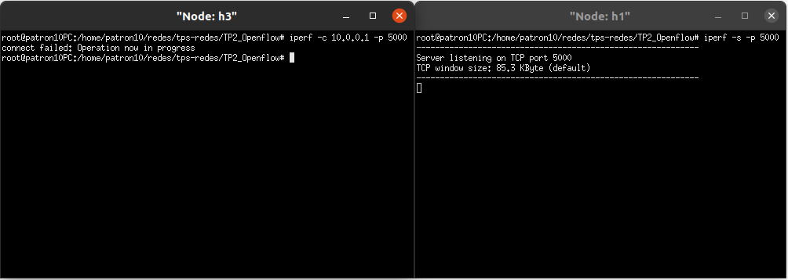
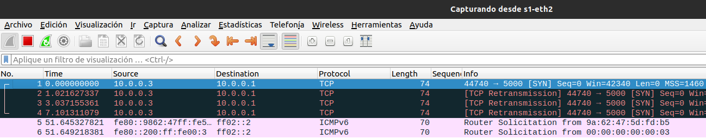

  

---

  # Trabajo Práctico 2: Software-Defined Networks

  ## Introducción a los sistemas distribuidos (75.43)

  ### Docentes:
  Juan Ignacio López Lecora.

  Agustín Horn.

  ### Integrantes:

  Francisco Florit - 104289

  Amaru Gabriel Durán - 97013

  Valentín Flores - 107719

  Federico Jaleh - 105553

  Gastón Frenkel - 107718

  ### Fecha de entrega

  18 de Junio de 2024

## Introducción

El trabajo práctico tiene como objetivo Adquirir conocimientos y práctica sobre las Software Defined Networks(SDN) y OpenFlow, como así también en el uso de herramientas de simulación de redes como mininet.

Para ello se tuvo como objetivo implementar una topología dinámica, donde a través de OpenFLow se construyó un firewall a nivel capa de enlace.

## Pruebas

### 1. descartar todos los mensajes cuyo puerto destino sea 80.

Se puede observar que al iniciar el servidor con puerto 80 utilizando el protocolo tcp en h4:

Al momento de generar una conexión con un cliente en h2 se puede ver que se rechazan las conexiones provenientes de h2.

Al iniciar el servidor con puerto distinto de 80, en este caso con un puerto 12345:

Al momento de generar una conexión con un cliente en h2 se puede ver que se envían los mensajes sin problemas.

### 2. descartar todos los mensajes que provengan del host 1, tengan como puerto destino el 5001, y esten utilizando el protocolo UDP.

Se puede observar que al iniciar el servidor con puerto 5001 utilizando el protocolo udp con el flag `-u` en h4:

Al momento de generar una conexión con un cliente en h1 se puede ver que se rechazan las conexiones provenientes de h1.

Mientras que si por ejemplo generamos un cliente desde h2 esto no sucede y se envían los mensajes sin problemas:

servidor h4:

### 3. Dos hosts no se pueden comunicar.

En nuestro caso elegimos los hosts 1 y 3, los cuales no se pueden comunicar:

#### Caso UDP

Levantamos un server en h1 y se verifica que desde h3 no se le puede enviar mensajes:

Levantamos server en h3 y se verifica que desde h1 no se le puede enviar mensajes:

#### Caso TCP

Levantamos un server TCP en h1 y se verifica que desde h3 no se le puede enviar mensajes:

Con wireshark se puede ver que en el switch 1, que es donde tenemos instalado el firewall, figura que se pierden paquetes por retransmisión de SYN:

Ahora, Levantamos server en h3 y se verifica que desde h1 no se le puede enviar mensajes:

Mismo análisis visto desde wireshark, pero desde el link de salida a h1:

## Preguntas a responder

_**¿Cuál es la diferencia entre un Switch y un router? ¿Qué tienen en común?**_

Tanto los routers como los switches se dedican a redireccionar datos en una red para que lleguen de un origen a un destino. La principal diferencia es que los routers conectan redes entre sí utilizando las direcciones IP del destino y los switches conectan dispositivos dentro de la misma red local, utilizando las direcciones MAC.

_**¿Cuál es la diferencia entre un Switch convencional y un Switch OpenFlow?**_

La diferencia entre un switch openflow y uno convencional radica en el control de los mismos. 

Los switch openflow tienen un control centralizado donde la lógica de red se separa del hardware y se maneja desde el “control plane” del SDN, es desde este lugar del que se toma la decisiones de filtrado de paquetes, eleccion de flujo del paquete, etc. Sin embargo, los switch tradicionales tienen un control distribuido y cada switch, en el propio hardware, manejan su propia lógica de control basados en sus tablas de direcciones Mac y políticas de configuración para decidir si hay que filtrar algún paquete.

_**¿Se pueden reemplazar todos los routers de la Intenet por Switches OpenFlow? Piense en el escenario interASes para
elaborar su respuesta**_

Teniendo en cuenta los escenarios SA, los routers están preparados para gestionar tráfico a una gran escala dado que utilizan hardware especializado (ASICs) para procesar rápidamente los paquetes, sin embargo en los casos de los switches openFlow requieren una conexión constante con el plano de control para tomar decisiones de enrutamiento, acción que podría agregar latencia. Además, los routers utilizan protocolos más complejos que los utilizados por los switches, como por ejemplo el protocolo de enrutamiento BGP (Border Gateway Protocol), utilizado precisamente a la hora de mantener conexiones entre distintos sistemas autónomos (AS)

## Dificultades encontradas

- Instalar dependencias.
- Setear el firewall con OpenFlow.
- Parchear código de Pox en python3.

## Conclusiones

El trabajo práctico nos permitió entender más en profundidad como funcionan las "Software Defined Networks" y darnos la experiencia de poder separar el plano de datos, donde se encuentran los switches generados por nuestra topologia lineal de N switches variables, del plano de control, de forma que pudimos programar en el mismo la lógica que nos permite decidir qué paquetes filtrar a través del switch que tiene configurado un firewall, utilizando una serie de reglas definidas por nosotros mismos.
